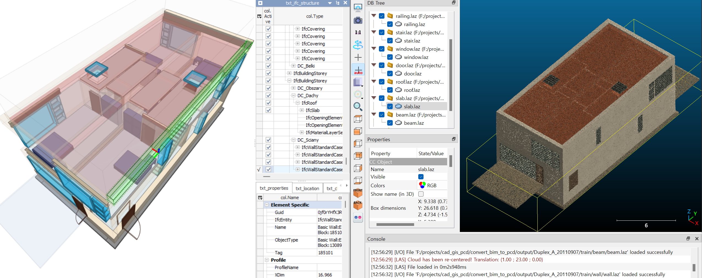
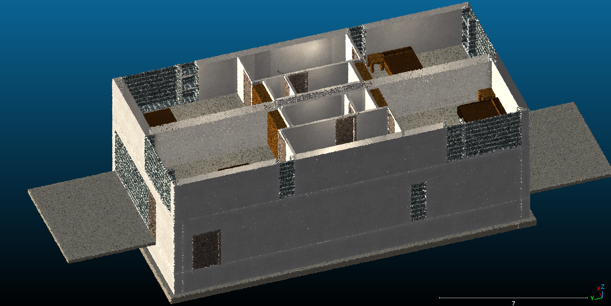
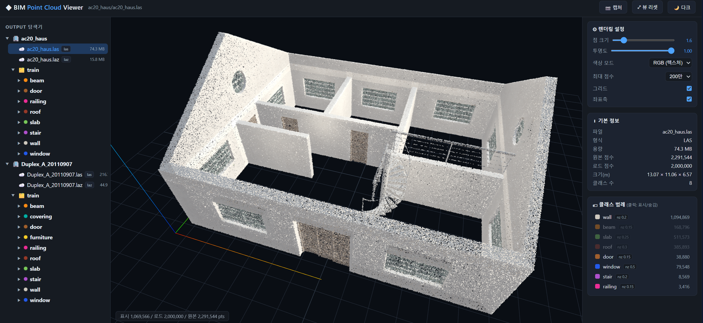
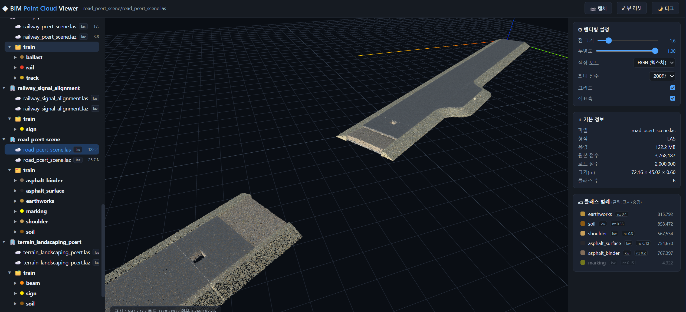
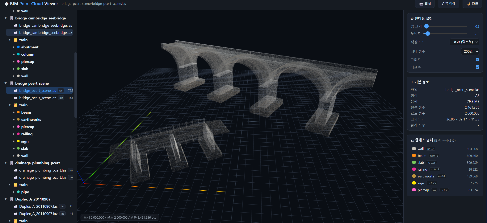
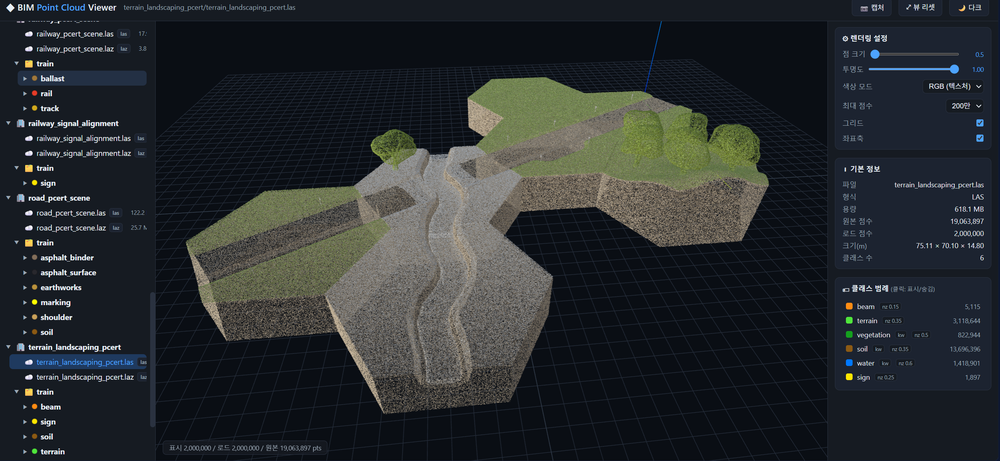

# Convert BIM to PCD — IFC (BIM) → Textured FBX + RGB Point Cloud (LAS/LAZ) Converter

A pipeline that parses and analyzes IFC models to perform the following steps in one pass: **1. automatically acquire material textures per IFC class → 2. generate a textured FBX with UV-mapped surfaces → 3. save real-coordinate RGB point clouds (LAS/LAZ) with texture colors → 4. produce per-class train datasets (txt/laz + labels.json) for deep-learning segmentation**. Results can be viewed instantly in the built-in **Flask web viewer (dark mode, Three.js)**.

<p align="center">
  </img></br>
  </img>
  </img></br>
  </img>
  </img></br>
  </img>
</p>

*Point cloud conversion result of ac20_haus.ifc (front/top views) — plaster walls, glass windows, wooden doors, and metal beams are distinguished by texture color.*

---

## Processing Pipeline

```
  input/*.ifc
      │
      │  1. Texture acquisition (texture_manager.py)
      │     IFC product class → category → material search query
      │     ambientCG (CC0) download  or  procedural generation (offline fallback)
      ▼
  textures/<category>.jpg
      │
      │  2. Geometry extraction + UV mapping (ifcopenshell / uv_mapping.py)
      │     World-coordinate (meter) mesh → UV generation via triplanar projection
      │
      ├──▶ 3-A  Textured FBX  (fbx_exporter.py, aspose.threed)
      │        Per-category PhongMaterial (diffuse texture) + per-object UV mesh
      │        → output/<model>/<model>.fbx (+ textures/ bundled)
      │
      └──▶ 3-B  RGB Point Cloud  (laspy)
               Face Poisson sampling → bilinear texture color sampling per point UV
               → output/<model>/<model>.las / .laz  (real coordinates + RGB + classification)
```

---

## File Structure

| File | Role |
|------|------|
| `run.bat` / `run.sh` | Launcher scripts (auto-detect `venv_lmm` Python, forward args, `viewer`/`textures` subcommands) |
| `convert_ifc_to_las.py` | Main CLI orchestrator (parse → FBX → LAS/LAZ) |
| `texture_manager.py` | Acquires material textures per IFC class (ambientCG CC0 download / procedural fallback) |
| `uv_mapping.py` | Triplanar UV generation + bilinear texture sampling |
| `shading_fx.py` | Cheap game-engine photorealism: texture normal/cavity maps, crease-based edge AO, hemisphere ambient, IfcSpace interior point lights |
| `fbx_exporter.py` | Textured FBX scene builder based on aspose.threed |
| `webviewer.py` | Point cloud web viewer for the output folder (Flask + Three.js, dark mode) |
| `templates/viewer.html` | Web viewer frontend (tree navigation / 3D canvas / render settings) |
| `config.json` | Category ↔ IFC class mapping, representative colors, material queries, UV scale, noise level |
| `textures/` | Downloaded/generated texture cache + `manifest.json` (source & license) |
| `input/` `output/` | IFC input / converted output |

---

## Sample IFC Models (input/)

The `input/` folder ships with free, redistributable sample models: two buildings plus **12 infrastructure models** (bridges, shield tunnels, road, railway, terrain, and drainage) collected from public IFC repositories. **Every bundled file is verified to parse and triangulate with ifcopenshell 0.8.4** (supported schemas: IFC2X3, IFC4, IFC4X1, IFC4X2, IFC4X3 + ADD1/ADD2/TC1). Models published only in unsupported draft schemas (IFC4X4 / IfcTunnel extension, IFC4X3_RC2/RC3) were excluded.

### Buildings

| File | Description | Source |
|------|-------------|--------|
| `Duplex_A_20110907.ifc` | Duplex apartment (IFC2X3), classic buildingSMART sample | [buildingSMART Sample-Test-Files](https://github.com/buildingSMART/Sample-Test-Files) |
| `ac20_haus.ifc` | ArchiCAD 20 single-family house (IFC4) | ArchiCAD sample project |

### Bridges — ifcinfra.de (TUM / planen-bauen 4.0 Verkehrswege project)

German research project publishing real-world **IFC-Bridge (IFC4X2)** models, free to download at [ifcinfra.de IFC-Bridge examples](https://ifcinfra.de/ifc-bridge/bridge-abschluss/).

| File | Schema | Description | Download |
|------|--------|-------------|----------|
| `bridge_bergedorfer_strasse.ifc` | IFC4X2 | Bergedorfer Straße bridge (BAB1, Hamburg) by WTM Engineers; components classified per ASB-ING 2013 | [ifcbridge-model01.zip](https://ifcinfra.de/wp-content/uploads/2019/07/ifcbridge-model01.zip) |
| `bridge_a99.ifc` | IFC4X2 | A99 motorway bridge (Autobahndirektion Südbayern); B-rep geometry | [ifcbridge-model02.zip](https://ifcinfra.de/wp-content/uploads/2019/07/ifcbridge-model02.zip) |
| `bridge_cambridge_seebridge.ifc` | IFC4X2 | SEEBridge project model (University of Cambridge); mixed B-rep + extrusion geometry | [ifcbridge-model03.zip](https://ifcinfra.de/wp-content/uploads/2019/07/ifcbridge-model03.zip) |

### Road / Railway / Bridge / Terrain / Drainage — buildingSMART PCERT sample scene (IFC4X3_ADD2)

One connected infrastructure scene split by discipline, from the official buildingSMART import-certification samples: [buildingSMART/Sample-Test-Files](https://github.com/buildingSMART/Sample-Test-Files) → `IFC 4.3.2.0 (IFC4X3_ADD2)/PCERT-Sample-Scene/`.

| File | Structure | Description | Download |
|------|-----------|-------------|----------|
| `road_pcert_scene.ifc` | Road | Road corridor: pavement courses (`IfcCourse`), earthworks fills, road parts, surface markings | [Infra-Road.ifc](https://github.com/buildingSMART/Sample-Test-Files/raw/main/IFC%204.3.2.0%20(IFC4X3_ADD2)/PCERT-Sample-Scene/Infra-Road.ifc) |
| `railway_pcert_scene.ifc` | Railway | Rail track: 66 `IfcTrackElement` (sleepers etc.), `IfcRail` rails, ballast courses | [Infra-Rail.ifc](https://github.com/buildingSMART/Sample-Test-Files/raw/main/IFC%204.3.2.0%20(IFC4X3_ADD2)/PCERT-Sample-Scene/Infra-Rail.ifc) |
| `bridge_pcert_scene.ifc` | Bridge | Rail bridge: beams, columns, footings, spandrel walls, earthworks fills, signs | [Infra-Bridge.ifc](https://github.com/buildingSMART/Sample-Test-Files/raw/main/IFC%204.3.2.0%20(IFC4X3_ADD2)/PCERT-Sample-Scene/Infra-Bridge.ifc) |
| `terrain_landscaping_pcert.ifc` | Terrain | Landscaping: 76 `IfcGeographicElement` (terrain/vegetation), signs, members | [Infra-Landscaping.ifc](https://github.com/buildingSMART/Sample-Test-Files/raw/main/IFC%204.3.2.0%20(IFC4X3_ADD2)/PCERT-Sample-Scene/Infra-Landscaping.ifc) |
| `drainage_plumbing_pcert.ifc` | Drainage | Buried drainage: 24 `IfcPipeSegment`, manhole assemblies | [Infra-Plumbing.ifc](https://github.com/buildingSMART/Sample-Test-Files/raw/main/IFC%204.3.2.0%20(IFC4X3_ADD2)/PCERT-Sample-Scene/Infra-Plumbing.ifc) |

### Railway signals — buildingSMART IFC4.3 official samples

| File | Schema | Description | Download |
|------|--------|-------------|----------|
| `railway_signal_alignment.ifc` | IFC4X3_ADD2 | Railway signals (`IfcSignal`) linearly placed along an `IfcAlignment` with referents; from [buildingSMART/IFC4.3.x-sample-models](https://github.com/buildingSMART/IFC4.3.x-sample-models) | [linear-placement-of-signal.ifc](https://github.com/buildingSMART/IFC4.3.x-sample-models/raw/main/models/alignment-geometries-and-linear-positioning/linear-placement-of-signal/linear-placement-of-signal.ifc) |

### Tunnels — TUM shield-tunnel research models + buildingSMART IFC-Tunnel Deployment

The TUM Chair of Computational Modeling and Simulation published multi-scale **shield tunnel** product models (from their multi-scale geometric-semantic tunnel modeling research) at [tumcms/IfcTunnelExampleFiles](https://github.com/tumcms/IfcTunnelExampleFiles), exported in released schemas (IFC2X3/IFC4) using `IfcProxy` components — unlike most IfcTunnel datasets which require the unreleased IFC4X4 draft.

| File | Schema | Description | Download |
|------|--------|-------------|----------|
| `tunnel_shield_lod4_tum.ifc` | IFC4 | Shield tunnel, LoD4: lining space, annular gap (grout), interior space, roadway floor slab, service duct, clearance profile as separate `IfcProxy` objects along a curved alignment → converts to lining / road / pipe classes | [ProxyExtrudedAreaSolidBoolArbitraryProf_LoD4 - IFC4.ifc](https://github.com/tumcms/IfcTunnelExampleFiles/raw/master/01_IfcProxy/03_IfcExtrudedAreaSolid%2BIfcArbitraryClosedProfileDefinition%2BIfcCircle%2BIfcBooleanResult/ProxyExtrudedAreaSolidBoolArbitraryProf_LoD4%20-%20IFC4.ifc) |
| `tunnel_shield_lod3_tum.ifc` | IFC4 | Shield tunnel, LoD3: detailed faceted-B-rep tunnel tube (3.8 MB, ~543 k sampled points) | [IfcProxy_IfcFacetedBrep_LoD3_IFC4.ifc](https://github.com/tumcms/IfcTunnelExampleFiles/raw/master/01_IfcProxy/01_IfcFacetedBrep/IfcProxy_IfcFacetedBrep_LoD3_IFC4.ifc) |
| `tunnel_igutech_sprint_1.1.ifc` | IFC4 | Tunnel geology model (granite sections, joint surfaces, water ingress as `IfcBuildingElementProxy`) from [bSI-InfraRoom/IFC-Tunnel-Deployment](https://github.com/bSI-InfraRoom/IFC-Tunnel-Deployment) — complements the structural models above; converts to the rock class | [igutech_ifctunnel_sprint_1.1.ifc](https://github.com/bSI-InfraRoom/IFC-Tunnel-Deployment/raw/main/files/igutech/igutech_ifctunnel_sprint_1.1.ifc) |

**Repositories checked but excluded** (files exist but their schemas are unsupported by ifcopenshell 0.8.4):

| Repository | Why excluded |
|------------|--------------|
| [bSI-InfraRoom/IFC-Tunnel-Deployment](https://github.com/bSI-InfraRoom/IFC-Tunnel-Deployment) | Most tunnel datasets are IFC4X4 / IFC4X4_B072BCCA drafts (IfcTunnel extension) → `SchemaError` |
| [bSI-RailwayRoom/IFC-Rail-Sample-Files](https://github.com/bSI-RailwayRoom/IFC-Rail-Sample-Files) | Rich rail models (signaling, track, cables) but exported as IFC4X3_RC3 → `SchemaError` |
| [bSI-InfraRoom/IFC-infra-unit-test](https://github.com/bSI-InfraRoom/IFC-infra-unit-test) | Earthworks / alignment unit tests are IFC4X3_RC3 → `SchemaError` |
| ifcinfra.de models 04–05 (BeamBridge, suspension footbridge) | IFC4X2 draft alignment-based sweeps (`IfcSectionedSolidHorizontal`, `IfcTendon`) — parse but produce no geometry |

---

## Installation

Tested on Windows + conda environment (`venv_lmm`, Python 3.11). Required packages:

```powershell
# ifcopenshell is recommended to install via conda-forge
conda install -c conda-forge ifcopenshell

# Remaining packages via pip
pip install laspy[lazrs] numpy pillow tqdm aspose-3d matplotlib flask
```

| Package | Purpose |
|---------|---------|
| `ifcopenshell` (≥0.8) | IFC parsing and geometry triangulation |
| `laspy[lazrs]` | LAS/**LAZ** point cloud writing (LAZ compression requires the `lazrs` backend) |
| `aspose-3d` | Save FBX with textures and UV |
| `numpy`, `pillow`, `tqdm` | Numerical computation / texture images / progress bar |

> This repository uses `C:\ProgramData\miniconda3\envs\venv_lmm\python.exe`.

---

## Usage

### Launcher Scripts

`run.bat` (cmd/PowerShell) and `run.sh` (bash/git-bash) locate the `venv_lmm` interpreter automatically,
`cd` to the project folder, and forward every argument to `convert_ifc_to_las.py`.

```powershell
run.bat                          # convert everything in input/ with defaults
run.bat --spacing 0.03 --no-fbx  # any option below is passed straight through
run.bat viewer                   # web viewer only, no conversion
run.bat viewer -p 5099           # subcommand args are forwarded too
run.bat textures --no-download   # pre-generate textures only
```

```bash
./run.sh                         # same interface on bash / git-bash
./run.sh --no-fx
PYTHON=/path/to/python ./run.sh  # override the interpreter
```

Set `PYTHON` (env var on bash, `set "PYTHON=..."` on cmd) to use a different interpreter.
Both scripts propagate the Python exit code, so they compose in CI.

> `run.bat` is intentionally kept pure ASCII — `cmd.exe` parses `.bat` files using the console
> code page (CP949 on this machine), so UTF-8 comments get mangled into commands.

### Direct Invocation

```powershell
# Basic run: convert all IFC files in input/
python convert_ifc_to_las.py -i ./input -o ./output -c ./config.json

# Adjust point cloud density (3 cm spacing) and mesh precision
python convert_ifc_to_las.py --spacing 0.03 --tolerance 0.005

# Offline (procedural textures only) / skip FBX / LAS only
python convert_ifc_to_las.py --no-download
python convert_ifc_to_las.py --no-fbx
python convert_ifc_to_las.py --formats las

# Launch web viewer after conversion / viewer only without conversion
python convert_ifc_to_las.py --viewer
python convert_ifc_to_las.py --viewer-only --port 5013
python webviewer.py -o ./output -c ./config.json -p 5013
```

### Key Options

| Option | Default | Description |
|--------|---------|-------------|
| `--input, -i` | `./input` | IFC input folder |
| `--output, -o` | `./output` | Conversion output folder |
| `--config, -c` | `./config.json` | Category/texture configuration |
| `--textures` | `./textures` | Texture cache folder |
| `--spacing, -s` | `0.03` | Point cloud sample spacing (m). Smaller = denser and larger file |
| `--tolerance, -t` | `0.005` | Mesh linear deflection tolerance (m). Smaller = more precise curves |
| `--formats` | `las,laz` | Point cloud output format(s), comma-separated |
| `--no-download` | off | Disable online texture download (use procedural generation) |
| `--no-fbx` | off | Skip FBX generation |
| `--no-train` | off | Skip per-class train dataset generation |
| `--texture-mode` | (config) | `realistic` / `distinct`. Overrides config `settings.texture_mode` |
| `--no-shading` | off | Disable light-based shading |
| `--no-fx` | off | Disable the cheap photorealism effects (normal map / edge AO / hemisphere ambient / interior lights). Overrides config `settings.shading_fx` |
| `--no-clean` | off | Do not delete the model output folder before regenerating — only overwrite. By default `output/<model>/` is deleted and recreated on each run |
| `--seed` | `42` | Random seed for sampling (reproducibility) |
| `--viewer` | off | Launch web viewer after conversion |
| `--viewer-only` | off | Launch web viewer without running conversion |
| `--port` | `5013` | Web viewer port |

### Pre-downloading Textures Only

```powershell
python texture_manager.py -c ./config.json -t ./textures      # download
python texture_manager.py --no-download                       # procedural generation
```

---

## config.json Format

Per category, specify a list of IFC classes, a representative color (RGB, used as fallback when no texture is available), a material search query, and UV scale.

The bundled config covers building categories (wall/roof/window/…) plus **AEC infrastructure categories**: `road` (asphalt courses, surface markings, road parts), `ballast` & `track` & `rail` (railway), `pipe` (drainage pipes, manholes), `earthworks` (fills, base courses), `terrain` / `vegetation` / `soil` / `water` (geographic elements split by Name keywords — e.g. an `IfcGeographicElement` named "apple tree" goes to vegetation, "park - site - grass" stays terrain, "river stream" goes to water), `sign` (signs/signals), `rock` (tunnel geology proxies), Name-keyword bridge members `abutment` (`IfcWall` "Abutment"/"wingwall") / `piercap` (`IfcBeam` "PierCap", `IfcColumn` "pier"), and Name-keyword road parts `shoulder` (`IfcRoadPart` "shoulder"/"verge"), `asphalt_surface` / `asphalt_binder` (`IfcCourse` "surface course" / "binder course"), `marking` (`IfcSurfaceFeature` "line marking", procedural white paint). `road` remains the fallback for road elements whose Name matches none of these.

Civil IFC exports often reuse a handful of coarse classes (`IfcCourse`, `IfcEarthworksFill`, `IfcWall`, `IfcBeam`…) for very different materials, distinguishing them only by `Name` (e.g. "road asphalt binder course" vs "ballastbed", "Abutment 1" vs an interior wall). `name_keywords` is designed for exactly this: any number of Name patterns can be routed to a texture category, and each category — even one with no IFC class of its own — becomes a separate segmentation class in the point cloud, the train dataset, and the viewer legend (marked with a `kw` badge and a tooltip showing its mapping rules).

The top-level `settings` block (reserved key, not a category) defines the texture mode, lighting, and the cheap photorealism effects (`shading_fx`). All other keys are category definitions.

```json
{
  "settings": {
    "texture_mode": "realistic",
    "lighting": {
      "enabled": true,
      "type": "directional",
      "position": [1.3, 1.3, 1.6],
      "color": [255, 244, 214],
      "ambient": 0.4,
      "intensity": 0.9,
      "double_sided": false,
      "attenuation": {
        "enabled": true,
        "constant": 1.0,
        "linear": 0.5,
        "quadratic": 1.0,
        "range": 0
      }
    },
    "shading_fx": {
      "enabled": true,
      "normal_map":         { "enabled": true, "strength": 1.0, "detail_shadow": 0.5, "cavity_scale": 12 },
      "edge_ao":            { "enabled": true, "angle_threshold_deg": 35, "smooth_deg": 25,
                              "radius": 0.12, "strength": 0.55, "convex_highlight": 0.12,
                              "boundary_as_crease": true, "direct_weight": 0.5 },
      "hemisphere_ambient": { "enabled": true, "sky_color": [150, 175, 210],
                              "ground_color": [95, 85, 75], "intensity": 1.0 },
      "interior_light":     { "enabled": true, "source": "ifcspace", "color": [255, 236, 200],
                              "intensity": 0.55, "height_ratio": 0.85, "margin": 0.3,
                              "max_lights": 64, "min_volume": 1.0, "range_ratio": 0.5,
                              "attenuation": { "constant": 1.0, "linear": 0.7, "quadratic": 1.8 } }
    }
  },
  "wall": {
    "classes": ["IfcWall", "IfcWallStandardCase", "IfcCurtainWall"],
    "color": [180, 175, 168],
    "distinct_color": [205, 200, 190],
    "texture_query": "plaster wall",
    "uv_scale": 2.0,
    "noise": 0.2,
    "normal_strength": 0.8,
    "ao_strength": 1.0
  },
  "window": {
    "classes": ["IfcWindow"],
    "color": [130, 170, 200],
    "distinct_color": [35, 90, 235],
    "texture_query": "glass",
    "uv_scale": 2.0,
    "transparency": 0.55,
    "noise": 0.5
  }
}
```

**Category Keys**

| Key | Description |
|-----|-------------|
| `classes` | IFC entity classes to group into this category |
| `predefined` | (optional) Re-classify a shared IFC class by `PredefinedType` into this category. E.g., if a roof is modeled as `IfcSlab(PredefinedType=ROOF)` instead of `IfcRoof`, use `"predefined": {"IfcSlab": ["ROOF"]}` to route only those slabs to the roof category (remaining `IfcSlab` entities stay in slab). `predefined` takes precedence over `classes` per entity |
| `name_keywords` | (optional) Re-classify a shared IFC class by **`Name` substring** (case-insensitive) into this category. E.g. `"name_keywords": {"IfcGeographicElement": ["tree", "apple"]}` routes elements named "apple tree" to vegetation while other geographic elements stay in terrain. Also used for rail ballast (`IfcCourse` "ballastbed"), tunnel geology (`IfcBuildingElementProxy` "Granit"/"Kluft"/…), and bridge members (`IfcWall` "Abutment" → abutment, `IfcBeam` "PierCap" → piercap, `IfcEarthworksFill` "subgrade" → soil). Precedence per entity: `name_keywords` > `predefined` > `classes`; when several categories match, the one defined first in config wins. A category with `"classes": []` and only keywords is a **user-defined class**: since no real IFC class backs it, `train/labels.json` and the viewer identify it by the category name (`ifc_classes: ["<category>"]`, `user_defined: true`), and it still gets its own classification index and per-class train dataset like any other category |
| `procedural_only` | (optional) Always generate this category's texture procedurally from `color`, skipping the ambientCG download (used for `water` — no CC0 photo material fits) |
| `color` | Representative RGB (0–255). Fallback point cloud color when no texture is available |
| `distinct_color` | (optional) High-saturation RGB used in `texture_mode="distinct"` to visually distinguish classes (e.g., window=bright blue, roof=terracotta) |
| `texture_query` | ambientCG material search query (e.g., `concrete`, `plywood`, `metal steel`) |
| `texture_asset` | (optional) Pin an **exact ambientCG asset ID**. Use when `texture_query` does not resolve the desired material. E.g., terracotta roof tiles `RoofingTiles012A`, glass facade `Facade006`. Falls back to `texture_query` on download failure |
| `uv_scale` | Real-world distance (m) covered by one texture tile. Larger = coarser tiling |
| `transparency` | (optional) FBX material transparency 0–1. For glass etc. |
| `noise` | (optional) Point cloud noise level 0–1.0. Gaussian standard deviation `σ = noise × spacing` (m) to simulate scanner error. Set higher for highly reflective/refractive materials like glass |
| `normal_strength` | (optional, default `1.0`) Per-category multiplier on `shading_fx.normal_map` strength (bump + cavity). Raise for rough materials (roof tiles `1.4`), lower for flat/glossy ones (glass `0.2`) |
| `ao_strength` | (optional, default `1.0`) Per-category multiplier on `shading_fx.edge_ao` strength and convex highlight |

**settings.texture_mode**

| Value | Description |
|-------|-------------|
| `realistic` | Download from ambientCG (CC0) or use procedurally generated materials (default) |
| `distinct` | Generate high-saturation per-category textures under `textures/distinct/` for clear class separation |

Override the config value with `--texture-mode {realistic,distinct}`. To pre-generate only the high-saturation textures, run `python texture_manager.py --distinct --force`.

**settings.lighting** — Applies light-based shading (Lambert diffuse) to the point cloud texture RGB

| Key | Description |
|-----|-------------|
| `enabled` | Shading on/off (also disabled by `--no-shading`) |
| `type` | `directional` (sunlight, parallel rays) or `point` (positional light, direction varies with distance) |
| `position` | **Bbox-normalized coordinates** `[x,y,z]`. `0`=min corner, `1`=max corner, `>1`=outside. Default `[1.3,1.3,1.6]` = upper-right outside. Easy to position the light independently of model size |
| `color` | Light color RGB (0–255). Normalized so the max channel is 1, preserving only hue without darkening the scene. E.g., warm sunlight `[255,244,214]` |
| `ambient` | Ambient floor value 0–1. Minimum brightness for shadowed faces |
| `intensity` | Diffuse intensity. `brightness = ambient + intensity × max(0, n·L)` |
| `double_sided` | `true` = illuminate regardless of face orientation (softer shadows). `false` (default) = faces away from the light become dark, creating a shadow effect |
| `attenuation` | (optional, **applies only when `type="point"`**) Distance attenuation for point lights. See table below |

**settings.lighting.attenuation** — Point light distance attenuation: `att = 1 / (constant + linear·dₙ + quadratic·dₙ²)`,
where `dₙ = (light–point distance) / range`. Points farther from the light receive less diffuse brightness (ambient is not attenuated).
Not applied to `directional` lights.

| Key | Description |
|-----|-------------|
| `enabled` | Attenuation on/off. `false` = uniform brightness regardless of distance (legacy behavior) |
| `constant` | Constant term `kc`. At the light position (dₙ=0), `att = 1/kc`. Typically `1.0` |
| `linear` | Linear term `kl`. Gradual linear falloff |
| `quadratic` | Quadratic term `kq`. Physically-based (inverse-square) falloff. Larger = faster darkening |
| `range` | Distance normalization reference (m). `0` (default) automatically uses **the model bbox diagonal length** → `linear`/`quadratic` can be tuned independently of model size |

> Example: with defaults (`kc=1, kl=0.5, kq=1`), when the light–point distance equals `range` (dₙ=1), `att ≈ 0.4`; at half `range` (dₙ=0.5), `att ≈ 0.67` — a natural falloff.

> Shading is **face-normal Lambert diffuse** (faces away from the light darken), not ray-traced cast shadows. Light coordinates are computed from the full model bbox, so consistent shading is applied across the entire point cloud.

**settings.shading_fx** — Cheap real-time-game techniques that add photorealistic cues on top of the Lambert base
(`shading_fx.py`). Everything reuses data the pipeline already has (texture RGB, face normals, barycentric
coordinates), so no ray tracing or SSAO is involved. Disable entirely with `--no-fx` or `"enabled": false`.
Measured cost on the bundled samples (3.2 M points): **41 s → 63 s** (~1.5×).

| Sub-block | Technique | What it does |
|-----------|-----------|--------------|
| `normal_map` | Bump mapping + cavity map | Treats texture luminance as a heightmap; its gradient perturbs the face normal so mortar joints and wood grain catch light. The high-frequency component (height minus a blurred copy) darkens recessed pixels. Preprocessed **once per texture** |
| `edge_ao` | Crease-based ambient occlusion | Classifies shared mesh edges as concave (valley) or convex (ridge) by dihedral angle, then darkens/brightens by distance to the edge. Distance is free: `d = barycentric[i] × (2·area / opposite edge length)` |
| `hemisphere_ambient` | Hemisphere ambient lighting | Replaces the flat `ambient` constant with a sky/ground-color lerp driven by `n.z` — upward faces get sky light, downward faces get bounce. One lerp |
| `interior_light` | IfcSpace point lights | Auto-places a point light near the ceiling of each `IfcSpace` bbox and applies distance-attenuated diffuse **only to points inside that space** (a miniature of tiled/clustered lighting) |

| Key | Description |
|-----|-------------|
| `normal_map.strength` | Bump intensity. `0` = face normals only. Scaled per category by `normal_strength` |
| `normal_map.detail_shadow` | Cavity darkening 0–1. Multiplied straight into the sampled color |
| `normal_map.cavity_scale` | Blur radius divisor for cavity extraction. Larger = only finer detail counts as a cavity |
| `edge_ao.angle_threshold_deg` | Dihedral angle above which an edge counts as a crease. Lower = more edges shaded |
| `edge_ao.smooth_deg` | Ramp width above the threshold, so crease strength fades in instead of popping |
| `edge_ao.radius` | AO falloff distance in meters: `exp(−d / radius)`. `0.12` ≈ a 12 cm shadow band along corners |
| `edge_ao.strength` | Darkening at concave creases 0–1. Scaled per category by `ao_strength` |
| `edge_ao.convex_highlight` | Brightening at convex creases (edge-wear look). `0` disables |
| `edge_ao.boundary_as_crease` | Treat open (unshared) edges as concave creases. Set `false` if a model's meshes are poorly welded and everything looks too dark |
| `edge_ao.direct_weight` | How much AO occludes **direct** sunlight, 0–1. AO always fully occludes ambient and interior light; `0.5` = direct light is half-occluded (physically loose but visually strong) |
| `hemisphere_ambient.sky_color` / `ground_color` | Ambient hue for upward / downward facing normals. Normalized to max channel = 1 |
| `hemisphere_ambient.intensity` | Overall multiplier on the hemisphere ambient term |
| `interior_light.source` | `ifcspace` only for now. Models without `IfcSpace` silently get no interior lights |
| `interior_light.intensity` | Diffuse intensity of each room light |
| `interior_light.height_ratio` | Light height within the space bbox. `0.85` = near the ceiling |
| `interior_light.margin` | Bbox expansion (m) for the light's influence volume, so walls bounding the room are lit |
| `interior_light.max_lights` | Cap on light count (largest spaces win). Dropped spaces are reported on the console |
| `interior_light.min_volume` | Skip spaces smaller than this (m³) — shafts, tiny voids |
| `interior_light.range_ratio` | Attenuation reference distance as a fraction of the space diagonal |
| `interior_light.attenuation` | `att = 1 / (constant + linear·dₙ + quadratic·dₙ²)`, `dₙ = distance / range` |

Classes not present in the schema (e.g., `IfcFurniture` in IFC2X3) are automatically skipped.

---

## Output

Generated under `output/<model_name>/`.

| File | Contents |
|------|----------|
| `<model>.fbx` | 3D mesh with textures/UV/materials mapped (nodes grouped by category) |
| `<model>.las` | Real-coordinate (meter) RGB point cloud, `point_format=3` |
| `<model>.laz` | LAZ-compressed version of the above point cloud |
| `textures/` | Texture copies referenced by relative path from the FBX (move together with the FBX) |
| `train/` | Per-class dataset for deep-learning segmentation training (see below) |

### train/ Dataset (for Point Cloud Segmentation Training)

```
output/<model>/train/
├── labels.json            # Class labeling metadata (index, IFC class, color, noise, point count, file paths)
├── wall/
│   ├── wall.txt           # CSV: x,y,z,red,green,blue,classification (1 header line)
│   └── wall.laz           # Point cloud for this class only (RGB + classification)
├── window/
│   ├── window.txt
│   └── window.laz
└── ...
```

Example `labels.json`:

```json
{
  "source_ifc": "ac20_haus.ifc",
  "spacing_m": 0.03,
  "noise_model": "gaussian, sigma = noise * spacing (m)",
  "num_classes": 8,
  "total_points": 12345678,
  "classes": [
    {"index": 1, "name": "wall", "ifc_classes": ["IfcWall", "..."], "user_defined": false,
     "color": [180,175,168], "noise": 0.2, "num_points": 4567890,
     "files": {"txt": "wall/wall.txt", "laz": "wall/wall.laz"}},
    {"index": 24, "name": "abutment", "ifc_classes": ["abutment"], "user_defined": true,
     "name_keywords": {"IfcWall": ["abutment", "wingwall"]},
     "color": [165,162,155], "noise": 0.25, "num_points": 32028,
     "files": {"txt": "abutment/abutment.txt", "laz": "abutment/abutment.laz"}}
  ]
}
```

`user_defined: true` marks a class defined purely by `name_keywords` (no real IFC class behind it); its `ifc_classes` then carries the user-defined category name so downstream training/label tooling always has a class identifier. The web viewer exposes the same fields via `/api/config` and shows a `kw` badge in the legend.

### Point Cloud Specification
- **Coordinates**: IFC world coordinates used as-is (meters). LAS header `scale=0.001` (mm precision), `offset=floor(min)`.
- **Color**: 8-bit RGB bilinearly sampled from the texture at each point's UV → (light shading applied) → LAS 16-bit (`×257`).
- **classification**: Index (1~) based on the category order in `config.json`. Usable as a semantic label.
- **Noise**: Gaussian noise with standard deviation `noise` (0–1) × `spacing` added to point coordinates per category (simulates real scan data).
- **Shading**: Lambert diffuse shading based on `settings.lighting` applied to RGB (faces away from the light darken), plus the `settings.shading_fx` effects (texture normal map, crease edge AO, hemisphere ambient, IfcSpace interior lights). Both the combined point cloud and train datasets are saved with shaded colors; `train/labels.json` records the active effects under `shading_fx`.

Compatible with CloudCompare, QGIS, PDAL, potree, and similar tools.

### Viewing the FBX
Open `<model>.fbx` in Blender, Autodesk FBX Review, etc. to see the textures.
Textures are referenced via relative path (`textures/<category>.jpg`), so **always move the FBX and `textures/` folder together**.

---

## Web Viewer (Flask + Three.js)

```powershell
python webviewer.py -o ./output -c ./config.json -p 5013
# or
python convert_ifc_to_las.py --viewer-only
```

Open `http://127.0.0.1:5013` in your browser.

| Feature | Description |
|---------|-------------|
| Folder tree navigation | Browse models / train / per-class point clouds (las·laz·txt) under output as a tree; click to load |
| 3D canvas | Three.js orbit camera (rotate/pan/zoom), grid and axis toggle, view reset |
| Render settings | Point size, opacity, color mode (RGB / class label / height colormap), max point count (server subsampling) |
| Info panel | File name, format, size; original/loaded point count; bounding box dimensions (m); class count. Clicking a train node shows a labels.json summary |
| Class legend | Config color-based legend + per-class point count and noise level; click to show/hide individual classes |
| Misc | Dark/light theme toggle (dark by default), screenshot capture as PNG |

Large point clouds are randomly subsampled on the server to the `max` parameter (default 2 million points) before transmission, enabling smooth browsing in the browser.

---

## UV Mapping (Triplanar Projection)

IFC geometry does not typically include UVs, so UVs are generated using **triplanar (box) projection** aligned to world coordinates.

1. For each triangle normal, select the **dominant axis** (the axis with the largest absolute component among x/y/z)
2. Project vertices onto the plane perpendicular to the dominant axis
3. Divide the projected coordinates by `uv_scale` (m/tile) to compute UV → tiling proportional to real-world dimensions

This produces seamless tiling on BIM models with many axis-aligned faces such as walls, floors, and ceilings. Point cloud colors also use the **same projection** to compute UV per point for sampling, so FBX textures and point cloud colors match exactly.

---

## License / Credits

- **Textures**: Uses **CC0 (public domain)** materials from [ambientCG](https://ambientcg.com). Download history, source, and license are automatically recorded in `textures/manifest.json`. Free to use and redistribute.
- **aspose-3d**: FBX saving works in free (evaluation) mode. However, the evaluation version has limitations **when re-reading files**, so geometry may appear empty when re-validated via aspose. The generated FBX file itself is complete and displays correctly in standard viewers such as Blender. Check the license before commercial redistribution.

---

## Troubleshooting

| Symptom | Cause / Fix |
|---------|-------------|
| Textures are only generated as `procedural` | Network blocked / offline. Change `texture_query` to a more generic term or re-run with internet access |
| LAZ save fails | Install the LAZ backend: `pip install laspy[lazrs]` |
| `Entity with name '...' not found in schema` | Class not present in schema — automatically skipped, safe to ignore |
| Textures not visible in FBX viewer | Verify that the `textures/` folder was moved together with the FBX file |
| Point cloud is too large / slow | Increase the `--spacing` value (e.g., 0.05–0.1) |

---

## Revision History

| Version | Date | Changes |
|---------|------|---------|
| **0.4.6** | 2026-07-17 | **Real shield-tunnel samples** from TUM CMS research ([tumcms/IfcTunnelExampleFiles](https://github.com/tumcms/IfcTunnelExampleFiles), IFC4 — parseable, unlike IFC4X4 drafts): `tunnel_shield_lod4_tum.ifc` (lining, annular gap, roadway floor, service duct, clearance as separate objects → 3 segmentation classes) and `tunnel_shield_lod3_tum.ifc` (detailed B-rep tube, ~543 k pts). New `lining` category (`IfcProxy` "lining"/"annular"/"interior"/"segment" → Concrete046); tunnel floor routes to road, service duct to pipe via `IfcProxy` Name keywords. igutech geology model kept for the rock class. |
| **0.4.5** | 2026-07-17 | **Fine-grained road segmentation, config-only** (no code change — pure `name_keywords`): `shoulder` (`IfcRoadPart` "shoulder"/"verge"), `asphalt_surface` vs `asphalt_binder` (`IfcCourse` "surface course" / "binder course"/"bitumen"), `marking` (`IfcSurfaceFeature` "line marking" etc., procedural white). The PCERT road scene now yields 6 classes (shoulder / asphalt surface / asphalt binder / marking / earthworks base course / soil subgrade) instead of 3; rail "ballastbed" keeps routing to ballast via category-order precedence. |
| **0.4.4** | 2026-07-17 | **User-defined classes for coarse civil IFC exports.** A category with `"classes": []` and only `name_keywords` is now a first-class user-defined class: `train/labels.json` and the viewer `/api/config` report `ifc_classes: ["<category>"]` + `user_defined: true` (plus the keyword rules), so segmentation labels always have an identifier even when no real IFC class backs them. Viewer legend marks such classes with a `kw` badge and a mapping-rule tooltip. New bridge-member categories from Name patterns: `abutment` (`IfcWall` "Abutment"/"wingwall"), `piercap` (`IfcBeam` "PierCap"/"crossbeam", `IfcColumn` "pier"); `IfcEarthworksFill` "subgrade" now routes to soil (base courses stay earthworks). Verified on the Cambridge SEEBridge (abutment/piercap split from wall/beam) and PCERT road scene (subgrade/base-course split). |
| **0.4.3** | 2026-07-17 | **AEC infrastructure texture mapping**: 12 new config categories (road, ballast, track, rail, pipe, earthworks, terrain, vegetation, soil, water, sign, rock) covering the bundled bridge/road/railway/terrain/drainage/tunnel models. New `name_keywords` config key re-classifies shared IFC classes by `Name` substring (e.g. `IfcGeographicElement` "apple tree" → vegetation, "river stream" → water, "ballastbed" `IfcCourse` → ballast, German tunnel geology proxies → rock); precedence `name_keywords` > `predefined` > `classes`. New `procedural_only` key forces procedural texture generation (water). Verified end-to-end on all bundled infra samples — the tunnel model (geology `IfcBuildingElementProxy` only) now converts instead of producing an empty cloud. |
| **0.4.2** | 2026-07-17 | Curated the bundled samples down to **10 verified infrastructure models**: every file now parses and triangulates with ifcopenshell 0.8.4. Removed 4 IFC4X4 tunnels (unsupported schema) and 2 IFC4X2 bridges with draft alignment-sweep geometry that yields no mesh. Added broader structure types from the buildingSMART PCERT IFC4X3_ADD2 certification scene (road corridor, railway track, rail bridge, terrain/landscaping, buried drainage) plus a railway-signal linear-placement sample. README sample section rewritten with per-file compatibility, sources, and an excluded-repositories table. |
| **0.4.1** | 2026-07-17 | Bundled 10 free infrastructure sample models in `input/`: 5 IFC4X2 bridges from ifcinfra.de (Bergedorfer Straße, A99, Cambridge SEEBridge, BeamBridge, suspension footbridge) and 5 IfcTunnel test models from buildingSMART IFC-Tunnel-Deployment (project team Sprint 2.3/3-Exc, ACCA, Bever Control, igutech). Added a "Sample IFC Models" README section with source repositories, descriptions, and download links. |
| **0.4.0** | 2026-07-17 | **Cheap photorealism effects** (`shading_fx.py`, `settings.shading_fx`): texture normal/bump map with cavity shadows, crease-based edge AO (concave darkening + convex highlight), hemisphere ambient, and auto-placed IfcSpace interior point lights. Per-category `normal_strength` / `ao_strength` overrides; `--no-fx` to disable. Added `run.bat` / `run.sh` launchers with `viewer` / `textures` subcommands. Code comments and CLI help unified to English. |
| **0.3.0** | 2026-07-15 | Lambert diffuse light shading of the point cloud RGB (`settings.lighting`: directional / point, bbox-normalized position, ambient, intensity, double_sided) with point-light distance attenuation (auto `range` from the model bbox diagonal). `distinct` texture mode for high-saturation per-class colors. `predefined` key to re-classify shared IFC classes by `PredefinedType` (fixes roofs modeled as `IfcSlab(ROOF)`). `texture_asset` key to pin an exact ambientCG asset ID; default texture mode set to `realistic`. Output folder is wiped before regeneration (`--no-clean` to opt out). |
| **0.2.0** | 2026-07-12 | Per-class training dataset (`train/<class>/<class>.txt` + `.laz`, `train/labels.json`). Per-class Gaussian noise (`noise` × spacing) to simulate scanner error. Flask + Three.js web viewer on port 5013 (tree navigation, render settings, class legend, deep links). |
| **0.1.0** | 2026-07-10 | Initial converter: IFC parsing via ifcopenshell, per-category ambientCG CC0 / procedural textures, triplanar UV projection, textured FBX export, and Poisson-sampled RGB LAS/LAZ point cloud with the category index in the classification field. |

---

# License
MIT License

# Author
Taewook Kang, Ph.D, laputa99999@gmail.com
